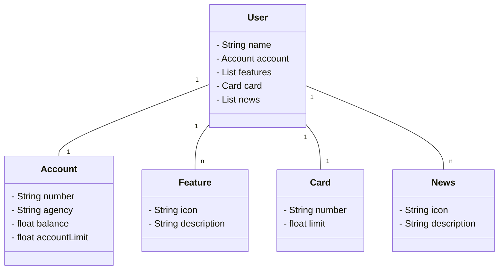

# Santander-Dev-Week-2023
Todo o código do exercício feito no desafio final do BootCamp santander 2023

##DIAGRAMA DE CLASSE

```mermaid
classDiagram
  class User {
    - String name
    - Account account
    - List<Feature> features
    - Card card
    - List<News> news
  }

  class Account {
    - String number
    - String agency
    - float balance
    - float accountLimit
  }

  class Feature {
    - String icon
    - String description
  }

  class Card {
    - String number
    - float limit
  }

  class News {
    - String icon
    - String description
  }

  User "1" -- "1" Account 
  User "1" -- "n" Feature 
  User "1" -- "1" Card 
  User "1" -- "n" News 
```
